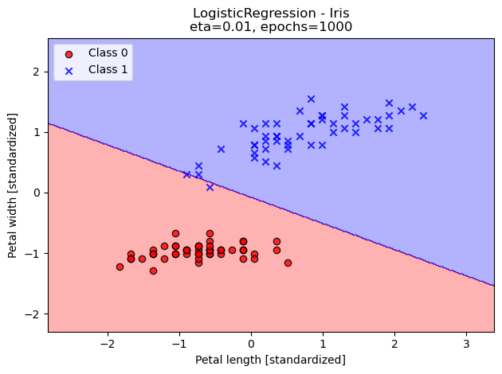
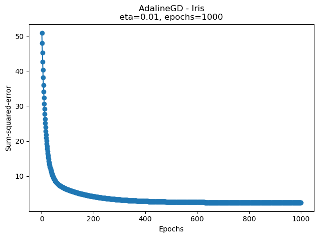
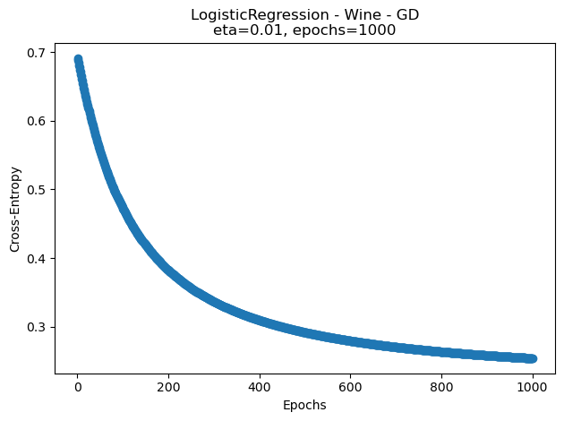
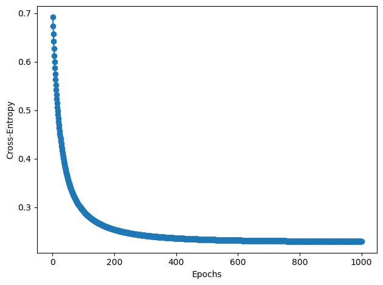
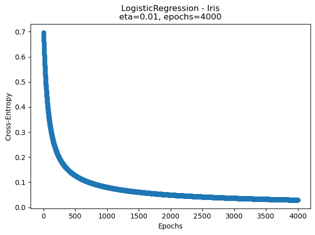
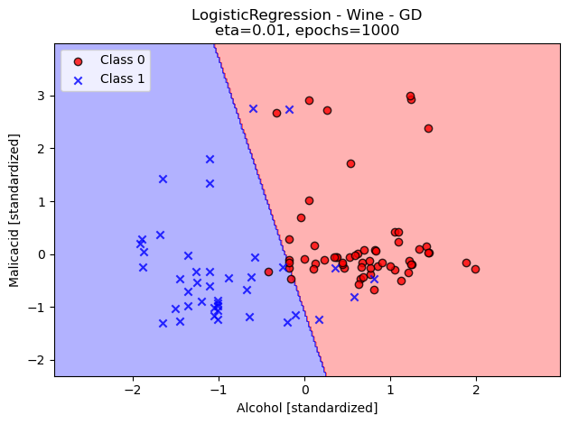
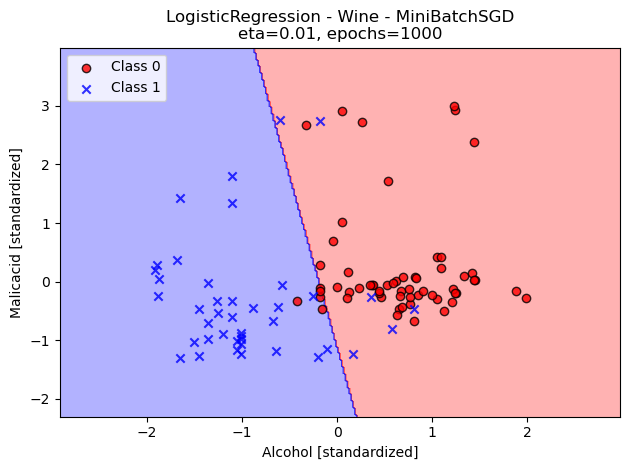
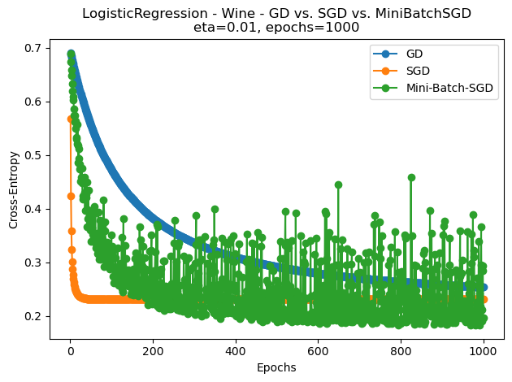
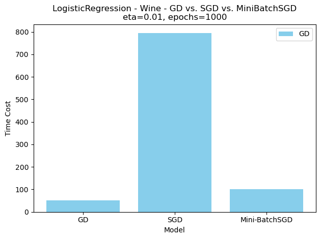

# Assignment 1: Adaline and Linear Regression
## Miles Nordwall, Nathan Nail

## Task #1


```python
import numpy as np
from datetime import datetime
import warnings
warnings.filterwarnings('ignore')
```


```python
NUM_ITER = 1000
ETA = 0.01

#global variable to keep track of runtimes of each model
ADA_IRIS_t = 0.0
LR_IRIS_t = 0.0
ADA_WINE_t = 0.0
LR_GD_WINE_t = 0.0
LR_SGD_WINE_t = 0.0
LR_MBATCH_WINE_t = 0.0
```


```python
class AdalineGD(object):
    """
    Orginal Implementation taken from textbook
    ADApative LInear NEuron Classifier
    Params: 
    eta (float) : Learning rate (between 0.0 and 1.0)
    n_iter (int) : Number of passes over the training dataset.
    random_state (int) : Random number generator seed for random weight initialization.

    Attrs:
    w_ (1d-array) : Weights after fitting.
    cost_ (list) : Sum-of-squares cost function value in each epoch.
    """
    def __init__(self, eta=0.01, n_iter=50, random_state=1):
        self.eta = eta
        self.n_iter = n_iter
        self.random_state = random_state
    def fit(self, X, y):
        """
        Fitting Training Data
        Params:
        X {array-like}, shape = [n_examples, n_features]
        Training vectors, where n_examples is the number of examples and n_features is the number of features.
        y (array-like) ,shape = [n_examples]
        Target values.

        Returns:
        self : Object
        """
        n = X.shape[0] #number of samples
        m = X.shape[1] #number of features 
        x_0 = np.ones((n,1)) 
        X = np.hstack((x_0,X)) #here we appended a column of 1's to X to make the dimensions match
                               #when doing the dot product with the weights when the bias is absorbed
        
        rand_gen = np.random.RandomState(self.random_state)
        self.w_ = rand_gen.normal(loc=0.0, scale=0.01,
                                  size=1 + m) # m + 1 so we can absorb the bias
        self.cost_ = []

        for _ in range(self.n_iter):
            net_input = self.net_input(X)
            output = self.activation(net_input)
            errors = (y - output)
            self.w_  += self.eta * 2.0 * X.T.dot(errors) / n
            
            cost = (errors**2).sum() / 2.0
            self.cost_.append(cost)

        return self
    def net_input(self, X):
        """Calculate net input"""
        return np.dot(X, self.w_)

    def activation(self, X):
        """Computer Linear Activation"""
        return X

    def predict(self, X):
        """Return class label after unit step"""
        n = X.shape[0] 
        m = X.shape[1] 
        x_0 = np.ones((n,1))
        X = np.hstack((x_0,X))
        return np.where(self.activation(self.net_input(X)) >= 0.0, 1, -1)
```


```python
class LogisticRegression(object):
    """
    Gradient descent-based logistic regression classifier
    Params: 
    eta (float) : Learning rate (between 0.0 and 1.0)
    n_iter (int) : Number of passes over the training dataset.
    random_state (int) : Random number generator seed for random weight initialization.

    Attrs:
    w_ (1d-array) : Weights after fitting with bias absorbed at X[0].
    losses_ (list) : Mean squared error loss function values in each epoch.
    """
    def __init__(self, eta=0.01, n_iter=50, random_state=1,
                 shuffle = False, batch_size = 0):
        self.eta = eta
        self.n_iter = n_iter
        self.random_state = random_state
        self.w_initialized = False
        self.shuffle = shuffle
        self.batch_size = batch_size

    def fit(self, X, y):
        """
        Fitting Training Data
        Params:
        X {array-like}, shape = [n_examples, n_features]
        Training vectors, where n_examples is the number of examples and n_features is the number of features.
        y (array-like) ,shape = [n_examples]
        Target values.

        Returns:
        self : Instance of LogisticRegression
        """
        n = X.shape[0] 
        m = X.shape[1] #number of features in dataset
        x_0 = np.ones((n,1))
        X = np.hstack((x_0,X))

        
        rand_gen = np.random.RandomState(self.random_state)
        self.w_ = rand_gen.normal(loc=0.0, scale=0.01,
                                  size=1 + m) #m + 1 to account for the
                                              #absorbed bias
        self.losses_ = []

        for _ in range(self.n_iter):
            net_input = self.net_input(X)            
            self.losses_.append(self._update_weights(X,y))

        return self
        
    def sgd_fit(self, X, y):
        '''Orignial implemenation grabbed from textbook AdalineSGD'''
        X = self._initialize_weights(X,X.shape[1])
        self.losses_ = []
        for i in range(self.n_iter):
            if self.shuffle:
                X, y = self._shuffle(X, y)
            losses_b = []
            for xi, target in zip(X, y):
                losses_b.append(self._update_weights(xi, target))
            avg_loss = np.mean(losses_b) 
            self.losses_.append(avg_loss)
        return self
        
    def fit_mini_batch_SGD(self, X, y):
        X = self._initialize_weights(X,X.shape[1])
        self.losses_ = []
        n_batch = np.ceil(X.shape[0] / self.batch_size)
        for _ in range(self.n_iter):
            if self.shuffle:
                X, y = self._shuffle(X, y)
                
            e_loss = 0.0                            #loss per epoch
            start = 0
            stop = len(X)
            step = self.batch_size
            
            for i in range(start, stop, step):
                X_b = X[i:i + self.batch_size]
                Y_b = y[i:i + self.batch_size]
       
                e_loss += self._update_weights(X_b, Y_b)
            
            self.losses_.append(e_loss/(n_batch))
        return self
        

    def _shuffle(self, X, y):
        """Shuffle training data"""
        r = self.rand_gen.permutation(len(y))
        return X[r], y[r]
        
    def _initialize_weights(self, X, m):
        """Initialize weights to small random numbers"""
        n = X.shape[0] 
        x_0 = np.ones((n,1))
        X = np.hstack((x_0,X))
        
        self.rand_gen = np.random.RandomState(self.random_state)
        self.w_ = self.rand_gen.normal(loc=0.0, scale=0.01,
                                  size=1 + m) #m + 1 to account for the
                                              #absorbed bias
        self.w_initialized = True
        return X
        

    def _update_weights(self, xi, y):
        """Apply logisitc reg. learning rule to update the weights"""
        n = xi.shape[0]
        output = self.activation(self.net_input(xi))
        error = (y - output)
        
        if self.batch_size > 1: #minibatch
            self.w_  += self.eta * 2.0 * xi.T.dot(error) / n
            loss = (-y.dot(np.log(output)) - ((1 - y).dot(np.log(1 - output)))
                    )/ n
        elif self.batch_size == 1: #this means SGD but no minibatch
            self.w_  += self.eta * 2.0 * xi * (error)
            loss = -y*(np.log(output)) - ((1 - y)*(np.log(1 - output)))
        
        else:
            self.w_  += self.eta * 2.0 * xi.T.dot(error) / n
            loss = (-y.dot(np.log(output)) - ((1 - y).dot(np.log(1 - output)))
                    )/ n
        return loss

    def net_input(self, X):
        """Calculate net input"""
        return np.dot(X, self.w_)

    def activation(self, X):
        """Computer Linear Activation"""
        return 1. / (1. + np.exp(-np.clip(X, -250, 250)))

    def predict(self, X):
        """Return class label after unit step"""
        n = X.shape[0]
        m = X.shape[1] #number of features in dataset
        x_0 = np.ones((n,1))
        X = np.hstack((x_0,X))
        return np.where(self.activation(self.net_input(X)) >= 0.5, 1, 0)
        
```

# Task #1 Report
To absorb the bias, we initialized the weight vector `self.w_` to be one dimension larger than the number of features and set the bias to be the first element, `self.w_[0]`. Leaving us with a dimension probelm: $$X\in \mathbb{R}^{n\times m}$$$$ w\in \mathbb{R}^{m+1}$$ Since we prepended the bias to the top of the weight vector, the dimension of the feature matrix $X$ needed to be adjusted to be able to compute the dot product of $X$ and $w$. To make the dimensions line up, we prepended a column of 1's to the features matrix $X$ making the dimensions $$X \in \mathbb{R}^{n\times m+1}$$ Therefore, giving us this linear combination: $$b(1)+w_1(x_1) + ... + w_n(x_n)$$ which is equivalent to $$[w_0(x_0)+w_1(x_1) + ... + w_n(x_n)]+b$$

## Task #2


```python
from matplotlib.colors import ListedColormap
import matplotlib.pyplot as plt
def plot_decision_regions(X, y, classifier, test_idx=None,
                          resolution=0.02):
    #taken from textbook
    # setup marker generator and color map
    markers = ('o', 'x', '^', 'v', '<')
    colors = ('red', 'blue', 'lightgreen', 'gray', 'cyan')
    cmap = ListedColormap(colors[:len(np.unique(y))])
    # plot the decision surface
    x1_min, x1_max = X[:, 0].min() - 1, X[:, 0].max() + 1
    x2_min, x2_max = X[:, 1].min() - 1, X[:, 1].max() + 1
    xx1, xx2 = np.meshgrid(np.arange(x1_min, x1_max, resolution),
                           np.arange(x2_min, x2_max, resolution))
    lab = classifier.predict(np.array([xx1.ravel(), xx2.ravel()]).T)
    lab = lab.reshape(xx1.shape)
    plt.contourf(xx1, xx2, lab, alpha=0.3, cmap=cmap)
    plt.xlim(xx1.min(), xx1.max())
    plt.ylim(xx2.min(), xx2.max())
    # plot class examples
    for idx, cl in enumerate(np.unique(y)):
        plt.scatter(x=X[y == cl, 0],
                    y=X[y == cl, 1],
                    alpha=0.8,
                    c=colors[idx],
                    marker=markers[idx],
                    label=f'Class {cl}',
                    edgecolor='black')
    # highlight test examples
    if test_idx:
        # plot all examples
        X_test, y_test = X[test_idx, :], y[test_idx]
        
        plt.scatter(X_test[:, 0], X_test[:, 1],
                    c='none', edgecolor='black', alpha=1.0,
                    linewidth=1, marker='o',
                    s=100, label='Test set')
```


```python
import os
import pandas as pd
s = os.path.join('https://archive.ics.uci.edu', 'ml',
                 'machine-learning-databases',
                 'iris','iris.data')
df = pd.read_csv(s,
                 header=None,
                 encoding='utf-8')
df_wine = pd.read_csv('https://archive.ics.uci.edu/ml/'
                      'machine-learning-databases/'
                      'wine/wine.data',
                       header=None,
                       encoding='utf-8')
```


```python
#select setosa and versicolor
y1_ada = df.iloc[0:100, 4].values
y1_ada = np.where(y1_ada == 'Iris-setosa', -1, 1)
y2_ada = df_wine.iloc[0:100, 0]
y2_ada = np.where(y2_ada == 2, 1, -1)

#extract sepal length and petal length
X1_ada = df.iloc[0:100, [0,2]].values
X2_ada = df_wine.iloc[0:100, [1,2]].values

#select setosa and versicolor for logistic regression
y1 = df.iloc[0:100, 4].values
y1 = np.where(y1 == 'Iris-setosa', 0, 1)
y2 = df_wine.iloc[0:100, 0]
y2 = np.where(y2 == 2, 1, 0)

#extract sepal length and petal length
X1 = df.iloc[0:100, [0,2]].values
X2 = df_wine.iloc[0:100, [1,2]].values
```


```python
#standarize
X_std1_ada = np.copy(X1_ada)
X_std1_ada[:,0] = (X1_ada[:,0] - X1_ada[:,0].mean()) / X1_ada[:,0].std()
X_std1_ada[:,1] = (X1_ada[:,1] - X1_ada[:,1].mean()) / X1_ada[:,1].std()
#standarize
X_std2_ada = np.copy(X2_ada)
X_std2_ada[:,0] = (X2_ada[:,0] - X2_ada[:,0].mean()) / X2_ada[:,0].std()
X_std2_ada[:,1] = (X2_ada[:,1] - X2_ada[:,1].mean()) / X2_ada[:,1].std()

#standarize for logistic regression
X_std1 = np.copy(X1)
X_std1[:,0] = (X1[:,0] - X1[:,0].mean()) / X1[:,0].std()
X_std1[:,1] = (X1[:,1] - X1[:,1].mean()) / X1[:,1].std()
#standarize
X_std2 = np.copy(X2)
X_std2[:,0] = (X2[:,0] - X2[:,0].mean()) / X2[:,0].std()
X_std2[:,1] = (X2[:,1] - X2[:,1].mean()) / X2[:,1].std()
```


```python
#plotting the decision boundary found for AdalineGD on the Iris dataset
ada_gd = AdalineGD(n_iter=NUM_ITER, eta=ETA)

ada_iris_start = datetime.now()
ada_gd.fit(X_std1_ada, y1_ada)
ada_iris_end = datetime.now()
ADA_IRIS_t = (ada_iris_end - ada_iris_start).total_seconds() *1000

plot_decision_regions(X_std1_ada, y1_ada, classifier=ada_gd)
plt.title(f'AdalineGD - Iris\n'
          f'eta={ETA}, epochs={NUM_ITER}')
plt.xlabel('sepal length [standardized]')
plt.ylabel('petal length [standardized]')
plt.legend(loc='upper left')
plt.tight_layout()
plt.show()

#plotting the decision boundary found for LinearRegression on the Iris dataset
lrgd = LogisticRegression(eta=ETA,
                             n_iter=NUM_ITER,
                             random_state=1)


lri_start = datetime.now()
lrgd.fit(X_std1, y1)
lri_end = datetime.now()
LR_IRIS_t = (lri_end - lri_start).total_seconds() * 1000

plot_decision_regions(X_std1, y1, classifier=lrgd)
plt.title(f'LogisticRegression - Iris\n'
          f'eta={ETA}, epochs={NUM_ITER}')
plt.xlabel('Petal length [standardized]')
plt.ylabel('Petal width [standardized]')
plt.legend(loc='upper left')
plt.tight_layout()
plt.show()

#plotting the convergence of the loss of AdalineGD for Iris dataset
plt.plot(range(1, len(ada_gd.cost_) + 1),
         ada_gd.cost_, marker='o')
plt.title(f'AdalineGD - Iris\n'
          f'eta={ETA}, epochs={NUM_ITER}')
plt.xlabel('Epochs')
plt.ylabel('Sum-squared-error')
plt.tight_layout()
plt.show()
print(f'AdalineGD - Iris {ADA_IRIS_t} ms')

#plotting the convergence of the loss of LinearRegression for Iris dataset
plt.plot(range(1, len(lrgd.losses_) + 1),
         lrgd.losses_, marker='o')
plt.title(f'LogisticRegression - Iris\n'
          f'eta={ETA}, epochs={NUM_ITER}')
plt.xlabel('Epochs')
plt.ylabel('Cross-Entropy')
plt.tight_layout()
plt.show()
print(f'LogisticRegression - Iris {LR_IRIS_t} ms')
```


    

    


    

    


    

    


    AdalineGD - Iris 7.484 ms


    

    


    LogisticRegression - Iris 38.378 ms


```python
#plotting the decision boundary found for AdalineGD on the Wine dataset
ada_gd2 = AdalineGD(n_iter=NUM_ITER, eta=ETA)

adaw_start = datetime.now()
ada_gd2.fit(X_std2_ada, y2_ada)
adaw_end = datetime.now()
ADA_WINE_t = (adaw_end - adaw_start).total_seconds() * 1000
#print(f'LogisticRegression - Iris {LR_IRIS_t} ms')


plot_decision_regions(X_std2_ada, y2_ada, classifier=ada_gd2)
plt.title(f'AdalineGD - Wine\n'
          f'eta={ETA}, epochs={NUM_ITER}')
plt.xlabel('Alcohol [standardized]')
plt.ylabel('Malicacid [standardized]')
plt.legend(loc='upper left')
plt.tight_layout()
plt.show()

#plotting the decision boundary found for LinearRegression on the Wine dataset
lrgd2 = LogisticRegression(eta=ETA,
                             n_iter=NUM_ITER,
                             random_state=1)

lrg_start = datetime.now()
lrgd2.fit(X_std2, y2)
lrg_end = datetime.now()
LR_GD_WINE_t = (lrg_end - lrg_start).total_seconds() * 1000

plot_decision_regions(X_std2, y2, classifier=lrgd2)


plt.title(f'LogisticRegression - Wine -GD\n'
          f'eta={ETA}, epochs={NUM_ITER}')
plt.xlabel('Alcohol [standardized]')
plt.ylabel('Malicacid [standardized]')
plt.legend(loc='upper left')
plt.tight_layout()
plt.show()

#plotting the convergence of the loss of AdalineGD for Wine dataset
plt.plot(range(1, len(ada_gd2.cost_) + 1),
         ada_gd2.cost_, marker='o')

plt.title(f'AdalineGD - Wine\n'
          f'eta={ETA}, epochs={NUM_ITER}')
plt.xlabel('Epochs')
plt.ylabel('Sum-squared-error')
plt.tight_layout()
plt.show()
print(f'AdalineGD - Wine {ADA_WINE_t} ms')

#plotting the convergence of the loss of LinearRegression for Wine dataset
plt.plot(range(1, len(lrgd2.losses_) + 1),
         lrgd2.losses_, marker='o')

plt.title(f'LogisticRegression - Wine - GD\n'
          f'eta={ETA}, epochs={NUM_ITER}')
plt.xlabel('Epochs')
plt.ylabel('Cross-Entropy')
plt.tight_layout()
plt.show()
print(f'LogisticRegression - Wine - GD {LR_GD_WINE_t} ms')
```


    

    


    

    


    

    


    AdalineGD - Wine 10.168 ms


    

    


    LogisticRegression - Wine - GD 52.207 ms


# Task #2 Report
### Iris Dataset
After running both models on a linearly seperable dataset for 1000 epochs with learning rate of 0.01, we can see that AdalineGD had no trouble at finding the correct decision boundary in less than 200 epochs while the LinearRegression model with GD did not find find a valid decision boundary in the allotted 1000 epochs. 
However, you can see from the the suplimental diagrams below directly below that at around 4000 epochs the LinearRegression model does correctly seperate the two classes. 
### Wine Dataset
The data given was not linearly seperable but we can see that from a classification standpoint, both AdalineGD and LinearRegression (using regular gradient descent) produced very similar decision boundaries after running for 1000 epochs with a learning rate $\eta$ = 0.01.


```python
# showing that LogisticRegression does produce a correct decision boundary after ~10,000 epochs
lrgd = LogisticRegression(eta=ETA,
                             n_iter=4000,
                             random_state=1)
lrgd.fit(X_std1, y1)
plot_decision_regions(X_std1, y1, classifier=lrgd)
plt.title(f'LogisticRegression - Iris\n'
          f'eta={ETA}, epochs={4000}')
plt.xlabel('Petal length [standardized]')
plt.ylabel('Petal width [standardized]')
plt.legend(loc='upper left')
plt.tight_layout()
plt.show()

plt.plot(range(1, len(lrgd.losses_) + 1),
         lrgd.losses_, marker='o')
plt.title(f'LogisticRegression - Iris\n'
          f'eta={ETA}, epochs={4000}')
plt.xlabel('Epochs')
plt.ylabel('Cross-Entropy')
plt.tight_layout()
plt.show()
```


    

    


    

    


## Task #3


```python
import numpy as np

class Perceptron:
    """
    Implementation taken from the textbook.

    Hyperparameters:
    eta: a float representing the learning rate. 

    n_iter: Number of epochs to run through. 

    random_state: An integer used as the seed for the 
    random state generator. Initializes small values for
    best performance to prevent overcorrecting. 
    
    If all weights were 0, all will have the same error. 
    "Broken symmetry" allows for algorithm to work. 

    Attributes:
    Indicated with a _ afterwards as part of naming convention (how?
    to what end?)

    w_: vector of weights as a 1D array.

    b_: Scalar int, bias unit. 

    errors_: a list 
    Number of misclassifications in each epoch. 
    """
    def __init__(self, eta = 0.01, n_iter = 50, random_state = 1):

        self.eta = eta
        self.n_iter = n_iter
        self.random_state = random_state
    def fit(self, X, y):
        """
        Fitting Training Data
        Params:
        X {array-like}, shape = [n_examples, n_features]
        Training vectors, where n_examples is the number of examples and n_features is the number of features.
        y (array-like) ,shape = [n_examples]
        Target values.

        Returns:
        self : Object
        """
        m = X.shape[1] #number of features in dataset
        rand_gen = np.random.RandomState(self.random_state)
        self.w_ = rand_gen.normal(loc=0.0, scale=0.01,
                                  size=1 + m) 
                                              
        self.errors_ = []

        for _ in range(self.n_iter):
            errors = 0 
            for xi, target in zip(X,y):
                update = self.eta * (target - self.predict(xi))
                self.w_[1:] += update * xi
                self.w_[0] += update #w_[0] is the bias
                errors+= int(update != 0.0)
            self.errors_.append(errors)
        return self
    def net_input(self, X):
        """Calculate net input"""
        return np.dot(X, self.w_[1:]) + self.w_[0]

    def predict(self, X):
        """Return class label after unit step"""
        return np.where(self.net_input(X) >= 0.0, 1, -1)
```


```python
"""
Docstring for multiclass

This implementation uses a one-vs-many approach, where different perceptrons are used. 
- One perceptron per iris class
- Modify true outputs such that the correct species is 1 and the two incorrect species are 0. 
- 

"""

class Multiclass():
    """
    Docstring for MultiPerceptron
    """

    def __init__(self):
        self.setosa_neuron = Perceptron(n_iter=NUM_ITER, eta= ETA)
        self.versicolor_neuron = Perceptron(n_iter=NUM_ITER, eta=ETA)
        self.virginica_neuron = Perceptron(n_iter=NUM_ITER, eta=ETA)
    def fit(self, X, y):
        self.setosa_neuron.fit(X,np.where(y == 0,  1, -1))
        self.versicolor_neuron.fit(X,np.where(y == 1,  1, -1))
        self.virginica_neuron.fit(X,np.where(y == 2,  1, -1))
        return self
    def predict(self, X):
        c = np.column_stack([self.setosa_neuron.predict(X),
                             self.versicolor_neuron.predict(X),
                             self.virginica_neuron.predict(X)])

        #select the class whose perceptron produces the largest output
        predicted = np.zeros(X.shape[0])
        for i in (range(X.shape[0])):
            best_value = c[i,0]
            best_label = 0
            for j in (range(c.shape[1])):
                if c[i,j] > best_value:
                    best_value = c[i,j]
                    best_label = j
            predicted[i]= best_label
            
        return predicted
        
```


```python
X_4 = df.iloc[:, [2, 3]].to_numpy()
Y_ref = df.iloc[:, 4].to_numpy()

Y_ref = np.where(Y_ref == 'Iris-setosa',0,Y_ref)
Y_ref = np.where(Y_ref == 'Iris-versicolor',1,Y_ref)
Y_ref = np.where(Y_ref == 'Iris-virginica',2,Y_ref)

X_std4 = np.copy(X_4)
X_std4[:,0] = (X_4[:,0] - X_4[:,0].mean()) / X_4[:,0].std()
X_std4[:,1] = (X_4[:,1] - X_4[:,1].mean()) / X_4[:,1].std()
```


```python
mc = Multiclass()
mc.fit(X_std4, Y_ref)
plot_decision_regions(X_std4, Y_ref, classifier=mc)

plt.title(f'Perceptron OvR - Iris - MultiClass\n'
          f'eta={ETA}, epochs={NUM_ITER}')
plt.xlabel('Petal length [standardized]')
plt.ylabel('Petal width [standardized]')
plt.legend(loc='upper left')
plt.tight_layout()
plt.show()
```


    

    


# Task #3 Report
For our multiclass classification we implemented a `Multiclass` class that stores and manages three seperate `Perceptron` models using the "One-vs-Rest" method. Each perceptron is assigned a different class and treats all the other classes as a negative value. To properly seperate the dataset by label, we relied on the `np.where()` function to replace the given string names with an integer value between [0-2]. Then a `Multiclass` instance is created and each perceptron is passed the same feature matrix $X$ but with a modified target vector $y$ that encodes the designated class as 1 and the others as -1. Each perceptron makes its predictions and all the results are compared and the perceptron that returned the highest decision value is appended to the final predicted class. 

We trained the model for 1000 epocs with a learning rate of 0.01 and from the diagram, you can see that overall OvR performed well but it had trouble properly classifying class 1. This may have been due to the fact that class 1 and class 2 are not linearly seperable, making it harder to classify. It's also possible that the argmax component of the OvR could've contributed to the classification errors since it doesn't have a robust method for handling ties for "best" label. But more than likely, the biggest culprit was the linear seperablity of the classes.

## Task #4


```python
plot_decision_regions(X_std2, y2, classifier=lrgd2)

plt.title(f'LogisticRegression - Wine - GD\n'
          f'eta={ETA}, epochs={NUM_ITER}')
plt.xlabel('Alcohol [standardized]')
plt.ylabel('Malicacid [standardized]')
plt.legend(loc='upper left')
plt.tight_layout()
plt.show()

lr_sgd = LogisticRegression(eta=ETA, 
                              n_iter =NUM_ITER,
                              batch_size=1,
                              shuffle=True)

sgd_start = datetime.now()
lr_sgd.sgd_fit(X_std2, y2)
sgd_end = datetime.now()
plot_decision_regions(X_std2, y2, classifier=lr_sgd)
LR_SGD_WINE_t = (sgd_end - sgd_start).total_seconds() * 1000

plt.title(f'LogisticRegression - Wine - SGD\n'
          f'eta={ETA}, epochs={NUM_ITER}')
plt.xlabel('Alcohol [standardized]')
plt.ylabel('Malicacid [standardized]')
plt.legend(loc='upper left')
plt.tight_layout()
plt.show()

minibatchSGD = LogisticRegression(eta=ETA, 
                                  n_iter=NUM_ITER, 
                                  batch_size=32,
                                  shuffle=True)
mini_start = datetime.now()
minibatchSGD.fit_mini_batch_SGD(X_std2, y2)
mini_end = datetime.now()
LR_MBATCH_WINE_t = (mini_end - mini_start).total_seconds() * 1000

plot_decision_regions(X_std2, y2, classifier=minibatchSGD)

plt.title(f'LogisticRegression - Wine - MiniBatchSGD\n'
          f'eta={ETA}, epochs={NUM_ITER}')
plt.xlabel('Alcohol [standardized]')
plt.ylabel('Malicacid [standardized]')
plt.legend(loc='upper left')
plt.tight_layout()
plt.show()

#plotting the convergence of the loss
plt.plot(range(1, len(lrgd2.losses_) + 1),
         lrgd2.losses_, marker='o')
plt.plot(range(1, len(lr_sgd.losses_) + 1),
         lr_sgd.losses_, marker='o')
plt.plot(range(1, len(minibatchSGD.losses_) + 1),
         minibatchSGD.losses_, marker='o')
plt.title(f'LogisticRegression - Wine - GD vs. SGD vs. MiniBatchSGD\n'
          f'eta={ETA}, epochs={NUM_ITER}')
plt.legend(['GD','SGD','Mini-Batch-SGD'])
plt.xlabel('Epochs')
plt.ylabel('Cross-Entropy')
plt.tight_layout()
plt.show()

#plotting the time cost
plt.bar(['GD', 'SGD', 'Mini-BatchSGD'], [LR_GD_WINE_t,LR_SGD_WINE_t,LR_MBATCH_WINE_t], color='skyblue')
#plt.xticks(x, cats)
#plt.legend()
#plt.show()
plt.title(f'LogisticRegression - Wine - GD vs. SGD vs. MiniBatchSGD\n'
          f'eta={ETA}, epochs={NUM_ITER}')
plt.legend(['GD','SGD','Mini-Batch-SGD'])
plt.xlabel('Model')
plt.ylabel('Time Cost')
plt.tight_layout()
plt.show()


print(f'LogisticRegression - Wine - GD {LR_GD_WINE_t} ms')
print(f'LogisticRegression - Wine - SGD {LR_SGD_WINE_t} ms')
print(f'LogisticRegression - Wine - MiniBatchSGD {LR_MBATCH_WINE_t} ms')
```


    

    


    

    


    

    


    

    


    

    


    LogisticRegression - Wine - GD 52.207 ms
    LogisticRegression - Wine - SGD 793.843 ms
    LogisticRegression - Wine - MiniBatchSGD 101.821 ms

